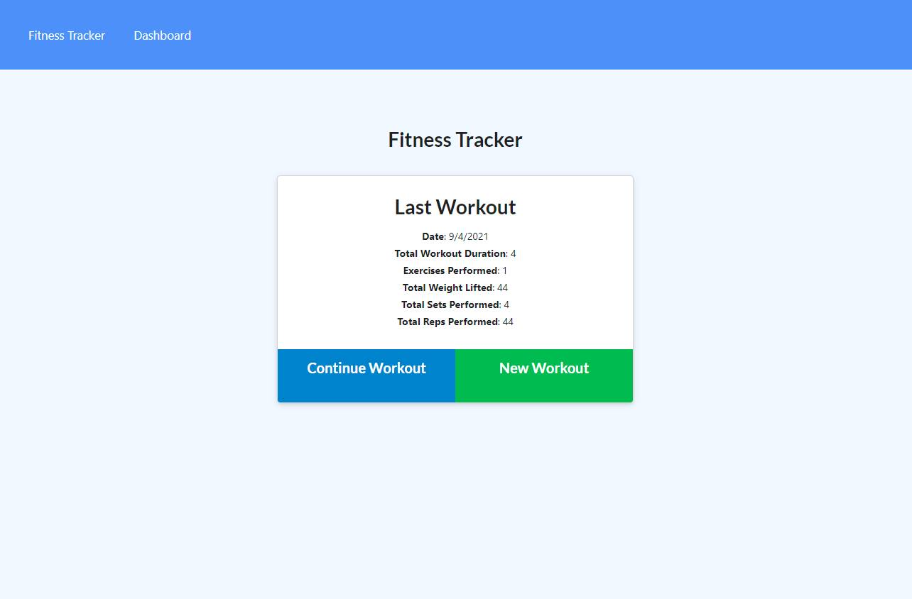

# 18-NoSQL-02-Homework

## Description

Fitness Tracker

## Table of Contents

- [Description](#description)
- [Usage](#usage)
- [Credits](#credits)
- [License](#license)
- [How to Contribute](#how-to-contribute)

## Installation

npm i then npm start

## Usage

Upon first launch of the site, you will click on New Workout to start a workout. Enter in what type of exercise you are recording and fill in the information in the form.
If you click Add Exercise it will allow you to enter in another type. When you are done entering your last exercise, click on teh Complete button to be taken back to the main page where you will see the totals you entered.  If you need to add another exercise, click on Continue Workout.
If you click on the Dashboard it will let you view the summary of you last exercises.

## Credits

University of Minnesota Boot Camp:
https://umn.bootcampcontent.com/University-of-Minnesota-Boot-Camp

## License

## How to Contribute

[Contributor Covenant](https://www.contributor-covenant.org/)

## Tests

None

## Questions

- For additional help or questions about collaboration, please reach out to jeff@jefflizseverson.com

- Follow me on Github at [jeffseverson2001](http://github.com/jeffseverson2001)
